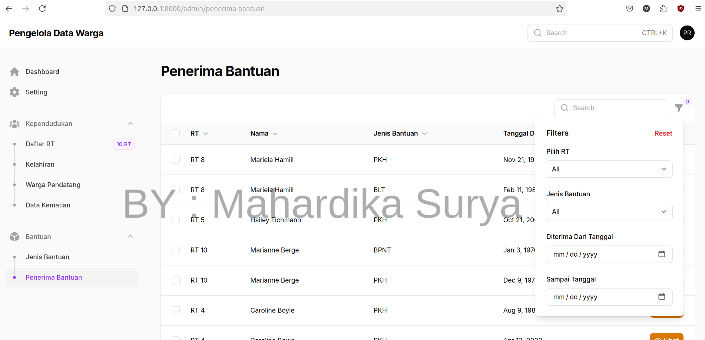

# 🎯 Web-Based Citizen Data Management Application ( Preview )

## A modern, responsive, and user-friendly **Web-Based Citizen Data Management Application** built with **Laravel 11** and **Filament 3**. This application helps manage and visualize demographic data efficiently at the neighborhood level.
---

## 🖥️ Fitur Utama
Aplikasi berbasis web ini memiliki 2 aktor utama, yaitu :
- Pengurus RW, memiliki hak akses ke seluruh RT yang ada
- Pengurus RT, hanya memiliki hak akses untuk mengelola data warga pada RT-nya masing-masing.
### 🏡 Dashboard
Menampilkan ringkasan data warga:
- Total jumlah RT dalam satu RW
- Total jumlah KK dan jumlah warga
- Perbandingan jumlah KK tetap dan tidak tetap
- Visualisasi data:
  - Jumlah warga per RT
  - Jumlah KK per RT
  - Grafik perbandingan KK tetap vs tidak tetap  

---

### ⚙️ Pengaturan Akun
Mengelola informasi akun pengguna:
- Ubah nama dan email
- Ganti kata sandi
- Aktifkan/nonaktifkan Two-Factor Authentication (2FA)  

---

### ⚖️ Manajemen RT
- Melihat dan mengelola daftar RT yang terdaftar  

### 👨‍👩‍👧‍👦 Data Warga per RT
- Menampilkan data warga berdasarkan masing-masing RT. 
- Pada halaman ini, pengurus RT maupun pengurus RW dapat memasukan data warga yang baru dengan mengunggah file excel. 
- Pengurus juga dapat mengunduh data warga pada aplikasi dalam bentuk excel, yang nantinya dapat digunakan untuk pelaporan data warga.

---

### 📝 Detail Data Keluarga
- Informasi lengkap setiap KK dan anggota keluarga di dalamnya  

---

#### 📝 Data Kelahiran
- Mencatat dan mengelola data kelahiran pada masing-masing RT

#### 📝 Data Pendatang
- Mencatat dan mengelola data warga pendatang baru. Dengan cluster desain yang dimiliki filament, data pendatang dibagi menjadi 2, yaitu data keluarga baru dan family lain.

#### ⚰️ Data Kematian
- Pencatatan warga yang meninggal dunia  

#### 📝 Jenis Bantuan
- Mendefinisikan kategori bantuan sosial yang tersedia  

#### 📝 Data Penerima Bantuan
- Mencatat individu atau keluarga penerima bantuan  

---

## 🛠️ Teknologi yang Digunakan

- **Laravel 11.x**
- **Filament 3.x**

---

## 📬 Kontak

Untuk mendapatkan **versi lengkap** dari aplikasi ini atau pertanyaan lebih lanjut, silakan hubungi:

💌 **hallodiik@gmail.com**

---

> ⚠️ *Ini adalah versi pratinjau (preview), yang mungkin belum mencakup seluruh fitur dari versi final aplikasi.*
